# Arsitektur Bot

Dokumen ini menjelaskan arsitektur teknis dan filosofi desain di balik bot ini. Tujuannya adalah untuk memberikan panduan bagi developer yang ingin memahami, memelihara, atau mengembangkan fungsionalitas bot.

## Filosofi Desain

Arsitektur bot ini dibangun di atas empat pilar utama:

1.  **Modularitas (Modularity)**: Setiap fitur utama (seperti moderasi, reaction roles, dll.) adalah komponen yang berdiri sendiri dan terisolasi di dalam foldernya masing-masing.
2.  **Pemisahan Tanggung Jawab (Separation of Concerns)**: Definisi perintah, logika bisnis, dan event listener dipisahkan ke dalam file yang berbeda untuk meningkatkan keterbacaan dan kemudahan pemeliharaan.
3.  **Skalabilitas (Scalability)**: Struktur ini dirancang untuk dapat tumbuh dari bot kecil untuk satu server hingga bot besar yang melayani ribuan server dengan menggunakan sharding dan database yang kuat.
4.  **Keterujian (Testability)**: Dengan memisahkan logika dari event Discord, kita dapat dengan mudah menulis tes otomatis untuk memastikan setiap fungsi berjalan sesuai harapan.

## Diagram Alur Sistem (High-Level)

Berikut adalah diagram alur sederhana tentang bagaimana sebuah interaksi dari Discord diproses oleh bot.

```mermaid
graph TD
    A[Discord Gateway] -- Interaksi (misal: /ban) --> B{Bot Process / bot.py};
    B -- Memuat Ekstensi --> C[Fitur Loader];
    C -- Mencari Fitur --> D[📂 features/];
    D -- Menjalankan Perintah --> E[moderation/commands.py];
    E -- Memanggil Logika Inti --> F[moderation/logic.py];
    F -- Interaksi DB --> G[🗄️ database/db_manager.py];
    F -- Menggunakan Fungsi Pembantu --> H[🛠️ utils/embeds.py];
    F -- Mengirim Balasan --> A;
```

## Rincian Komponen Arsitektur

#### 1. Titik Masuk & Konfigurasi (`src/bot.py` & `src/core/`)

-   **`src/bot.py`**: Ini adalah file utama yang dieksekusi untuk menjalankan bot. Tugasnya adalah:
    -   Mengimpor konfigurasi (seperti token) dari `src/core/config.py`.
    -   Menginisialisasi kelas bot kustom (`BotSaya` dari `src/core/bot_base.py` jika digunakan).
    -   Memulai proses pemuatan fitur (extensions/cogs).
    -   Menjalankan bot dan menghubungkannya ke Discord Gateway.
-   **`src/core/config.py`**: Bertanggung jawab untuk memuat variabel lingkungan dari file `.env` secara aman. Ini memastikan tidak ada kredensial rahasia yang ditulis langsung di dalam kode.

#### 2. Struktur Berbasis Fitur (`src/features/`)

Ini adalah inti dari arsitektur kami. Setiap sub-folder di dalam `features/` mewakili satu fitur utuh. Pola di dalam setiap folder fitur adalah sebagai berikut:

-   `__init__.py`: Bertindak sebagai "lem" yang mengimpor semua kelas `Cog` dari file lain dalam folder ini dan menyediakan fungsi `setup()` agar bot utama bisa memuatnya.
-   `commands.py`: **Wajah Fitur**. Berisi definisi dari semua Slash Command yang dilihat pengguna. File ini tidak berisi logika yang rumit, hanya mendefinisikan nama, deskripsi, dan opsi dari sebuah perintah.
-   `listeners.py`: **Telinga Fitur**. Berisi semua event listener (`on_member_join`, `on_message_delete`, dll.) yang relevan untuk fitur tersebut.
-   `logic.py` (atau file serupa): **Otak Fitur**. Berisi semua logika bisnis murni. Fungsi-fungsi di sini menerima parameter, memprosesnya, berinteraksi dengan database, dan mengembalikan hasil. File ini tidak secara langsung bergantung pada event Discord, membuatnya mudah untuk diuji.
-   `views.py`: **Tangan Fitur**. Berisi definisi komponen UI interaktif seperti Tombol (`discord.ui.Button`) dan Menu Dropdown (`discord.ui.Select`).

#### 3. Manajemen Database (`src/database/`)

-   `db_manager.py` bertindak sebagai **lapisan abstraksi (abstraction layer)** untuk database.
-   Alih-alih menulis query SQL mentah di dalam logika fitur, kita memanggil metode yang sudah didefinisikan di `db_manager`. Contoh: `await db.add_warning(...)` lebih baik daripada menulis `INSERT INTO ...`.
-   Pendekatan ini membuat kode fitur lebih bersih dan memungkinkan kita untuk mengganti jenis database (misalnya dari SQLite ke PostgreSQL) di masa depan dengan hanya mengubah file `db_manager.py`.
-   `schema.sql` adalah cetak biru yang mendefinisikan semua tabel dan struktur database.

#### 4. Utilitas Bersama (`src/utils/`)

Folder ini mematuhi prinsip **DRY (Don't Repeat Yourself)**. Semua kode yang berpotensi digunakan oleh lebih dari satu fitur harus ditempatkan di sini. Contohnya termasuk:
-   `embeds.py`: Fungsi untuk membuat pesan embed dengan format yang konsisten (misal: warna standar untuk pesan sukses dan error).
-   `checks.py`: Decorator kustom untuk pengecekan izin yang kompleks.

## Alur Kerja Sebuah Perintah (Contoh: `/warn`)

1.  **Pengguna** menjalankan `/warn @Pengguna alasan`.
2.  **Discord Gateway** mengirimkan event `Interaction` ke bot kita.
3.  **Bot (`bot.py`)** menerima interaksi dan meneruskannya ke pohon perintah (`CommandTree`).
4.  Pohon perintah menemukan kecocokan di kelas `Cog` yang dimuat dari `src/features/moderation/commands.py`.
5.  Fungsi `warn()` di dalam Cog tersebut dieksekusi.
6.  Fungsi `warn()` memanggil fungsi `logic.create_warning(user, reason)` dari `src/features/moderation/logic.py`.
7.  Fungsi `create_warning()` memanggil `await db.add_warning_to_db(...)` dari `src/database/db_manager.py` untuk menyimpan data ke database.
8.  Fungsi `create_warning()` memanggil `embeds.create_success_embed(...)` dari `src/utils/embeds.py` untuk membuat pesan balasan.
9.  Pesan embed dikirim kembali ke pengguna sebagai respons dari interaksi.

Arsitektur ini memastikan setiap komponen memiliki satu tanggung jawab yang jelas, membuat keseluruhan sistem menjadi kuat, terorganisir, dan siap untuk pengembangan lebih lanjut.